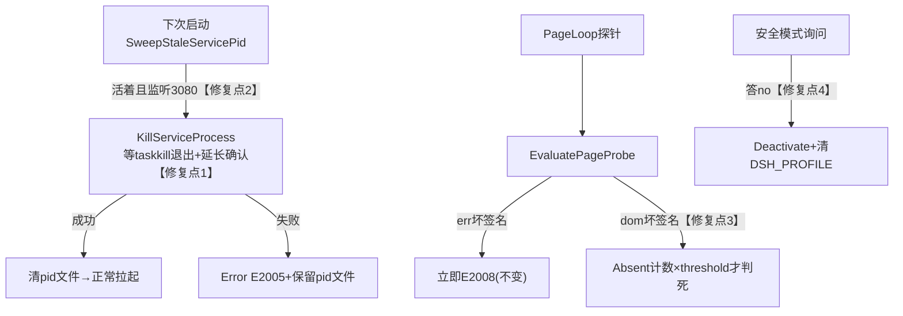

## 用户需求

分析并定位 dsh-launcher 无法正常启动的原因并修复。经日志取证已锁定三处代码级根因与两处现场残留：

## 根因结论

1. **E2008 页面误判**：DOM 已渲染完整会话列表（真实 UI 正常），仅因 body.innerText 中存在字面量 "bootstrap facade is missing" 即被坏签名一票判死；threshold=5 只用于好符号缺席，坏签名无累积机制，也无“实质内容已渲染”豁免。
2. **僵尸进程清扫不闭环**：KillProcess 强杀后仅等 300ms 即放弃（且未等待 taskkill 自身退出，存在竞态）；承诺的 "next-start sweep" 在 SweepStaleServicePid 中缺失「活着且监听目标端口」分支，真僵尸直接落空 → E2005 端口占用。
3. **安全模式粘滞**：用户对安全模式询问答 "no" 后，safe-mode.json（tier=1, active）未解除，后续所有会话静默以 --profile .dsh-safe 降级启动。

## 现场修复

- 清理残留 service-pid-3080.txt（pid 33312 已死）、空 boot.out.txt/boot.err.txt、解除 safe-mode.json 激活态。
- 对 09:31 零痕迹启动补充取证（System 事件日志、WER ReportQueue、PSReadLine 历史），无果则记录为一次性事件。

## 核心功能

- 进程终止链路可靠：温和→强制杀树全程限时且等待外部命令退出，失败响亮上报 E2005。
- 启动清扫闭环：pid 文件指向的真僵尸（活着且监听 3080）在下次启动被认领并清除。
- 页面健康判定抗误报：DOM 坏签名需连续多轮确认才判死，异常原文（__dshLastError）仍保持快速判死能力。
- 安全模式可退出：用户拒绝安全模式即恢复正常启动路径。

## Tech Stack

- 现有项目：C# / .NET 10 (net10.0-windows) WinForms 桌面启动器，xUnit 测试体系，PowerShell 构建/测试脚本（scripts/test.ps1 含静态断言，禁止削弱）。
- 全部修改复用现有架构：组合根 Program.cs、纯逻辑 ShellLogic.cs、领域状态 Domain/SafeModeState.cs、Headless/RealOS 分层测试。

## Implementation Approach

1. **KillProcess 竞态修复**：将杀树序列下沉为 `ShellLogic.ProcessManagement.KillServiceProcess(int pid, int port)`（符合 AGENTS.md 业务逻辑下沉铁律），内部用 `RunTaskKill(args, timeoutMs)` 封装：cmd.exe /c 包装 + 重定向输出 + WaitForExit 超时 + 超时 Kill(entireProcessTree)；温和阶段等待 taskkill 退出后再轮询进程（800ms），强杀阶段等待 taskkill 退出后确认窗口从 300ms 延长至 1500ms，仍活则重试一次强杀，最终失败保留 pid 文件并 Error 级 E2005 上报。Program.KillProcess 变为薄委托，签名不变（爆炸半径最小）。
2. **清扫闭环**：SweepStaleServicePid 增加「活着且 GetProcessIdByPort(port)==pid」分支 → 调用 KillServiceProcess 认领（其内部已有 IsLikelyDshService + 端口归属双重防误杀校验）；StopShellService 的端口释放探测超时后，反查占用 PID 并按同样身份校验尝试清理。性能：GetProcessIdByPort 走 GetExtendedTcpTable（亚毫秒级），无新增热路径开销。
3. **页面探针抗误判**（ShellLogic.BootGuard.EvaluatePageProbe 纯函数）：语义调整为——err（window.__dshLastError 异常原文）命中坏签名仍一票 BadSignature（保留 S22 快速捕获能力）；仅 DOM 文本命中坏签名降级为返回 Absent 并携带 `dom-suspect[签名]=原文摘录` 详情，由 BootHealthMonitor 按 AbsentThreshold 连续计数后才判死（证据不丢）。契约先行：先改 BootGuardContractTests 再改实现。
4. **安全模式解粘滞**：AskAndMaybeEnterSafeMode 中用户答 "no" 且 SafeMode.IsActive 时执行 Deactivate() + 清除 DSH_PROFILE 环境变量 + Trace 记录；SafeModeState.Deactivate 已存在，仅改组合根接线。
5. **回归防线**（TESTING-GUARDRAILS 强制）：P0/P1 修复必须补 `Regression_*` 零 Mock Category=RealOS 测试。

### 关键决策权衡

- 不引入 CTRL_BREAK 恢复（安全修复维持，误杀 shell 风险大于收益）；不改 BootProfile 默认参数（grace/threshold 保持，只修判定语义）；不动未提交的 TFM/SystemToast 改动（与本 Bug 无关）。

## Architecture Design



## Directory Structure

```
e:/dsh-launcher/
├── src/DshShell/
│   ├── Program.cs                          # [MODIFY] KillProcess 改为委托 ShellLogic；SweepStaleServicePid 补真僵尸分支；StopShellService 端口释放兜底反查；AskAndMaybeEnterSafeMode 答 no 时解粘滞
│   ├── ShellLogic.cs                       # [MODIFY] ProcessManagement 新增 KillServiceProcess/RunTaskKill；BootGuard.EvaluatePageProbe DOM 坏签名降级为 Absent(dom-suspect 详情)
│   └── Domain/SafeModeState.cs             # [不变] Deactivate 已具备，仅组合根接线
├── tests/DshShell.Tests/
│   ├── BootGuardContractTests.cs           # [MODIFY] 先行契约：dom 命中→Absent+详情；err 命中→BadSignature；实质内容无签名→Absent
│   ├── Lifecycle/BootHealthMonitorTests.cs # [MODIFY] dom 坏签名首轮不死、threshold 轮判死且证据携带；err 仍即时
│   ├── Domain/SafeModeStateTests.cs        # [NEW] Activate→Deactivate 落盘往返、损坏文件容错
│   └── Regression_BootLifecycle.RealOs.cs  # [NEW] Category=RealOS 零 Mock：真实 node 监听进程的杀树时限、僵尸 pid 文件认领闭环、探针判定语义
├── docs/SYSTEM_CAUSAL_MAP.md               # [MODIFY] 在节点 J(E2008)/EnsureServiceAndRuntime/安全模式询问边标记三处修复点
└── boot.out.txt / boot.err.txt             # [DELETE] cmd del 清理空重定向产物
```

## Implementation Notes

- 外部进程调用遵守 AGENTS.md 三必须：cmd.exe /c 包装 + 输出重定向 + 超时 Kill(entireProcessTree)；禁止新增空 catch，错误弹窗带 [E####]。
- KillServiceProcess 需 internal 可见供 RealOS 测试（仓库已有 InternalsVisibleTo 惯例，BootGuard 内部函数同模式）。
- 清理文件用 cmd del/rmdir（PowerShell 环境禁 Remove-Item）。
- 杀树等待上限合计约 4s，仅在退出/重启路径调用，不卡 UI（BeginShutdownAsync 已异步化）。