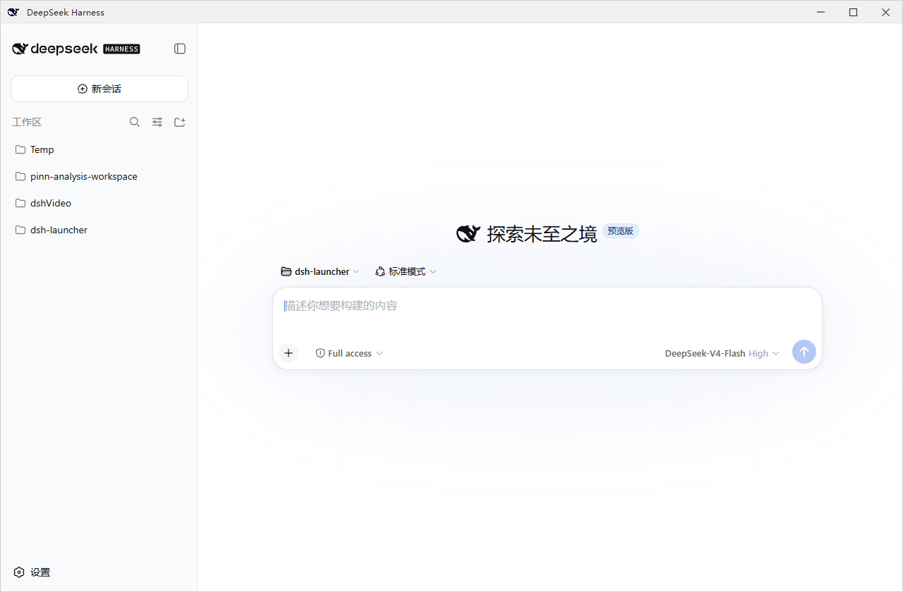
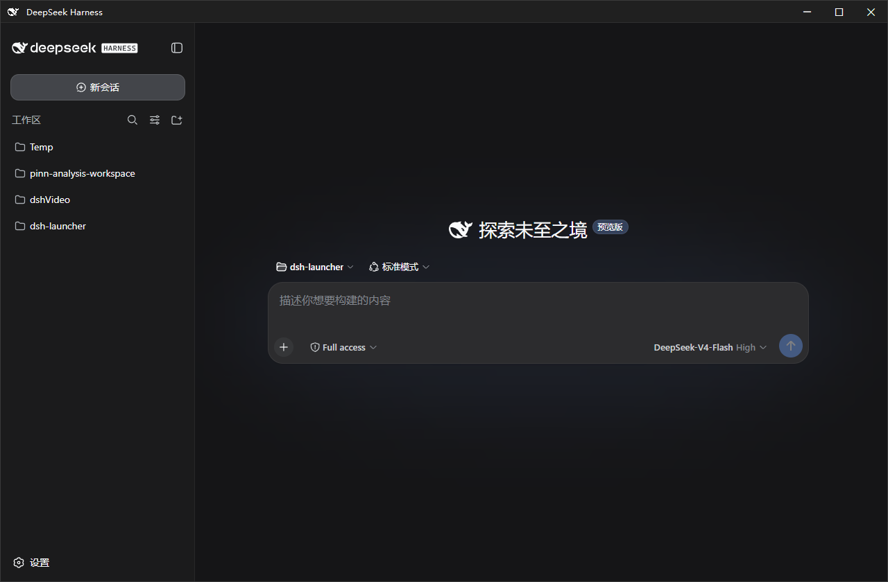

# dsh-launcher

[简体中文](README.md) · [English](README.en.md)

[](LICENSE)
[](https://whyihaveyou.github.io/dsh-suite/)

> A lightweight Windows launcher for DeepSeek Harness. Double-click to run — no command line needed.

| Light | Dark |
|---|---|
|  |  |

## What this is

A native Windows shell for [DeepSeek Harness](https://github.com/deepseek-ai/deepseek-harness) (`dsh`): double-click to run, optional autostart at logon, a small standalone window, with service lifecycle and error diagnostics handled for you. The installer is **~1.4MB**; it does not bundle dsh, and missing dependencies (Node.js, etc.) are filled on demand without touching system settings.

**Restraint**: it only recreates the original dsh experience — no file panel, no built-in terminal, nothing extra.

## Install

**MSI (recommended for beginners)**: download `dsh-launcher-<version>.msi` from [Releases](https://github.com/Ruler4396/dsh-launcher/releases), double-click to install (choose autostart in the wizard). Uninstall: Settings → Apps → dsh-launcher.

**Portable ZIP**: download `dsh-launcher-windows-<version>.zip`, extract, run `DshWeb.exe`; delete the folder to uninstall.

> Double-click does nothing? Run `check-prereq.cmd` from the extracted folder — it checks .NET / WebView2 / Node and prints install commands for anything missing.

## Features

- Autostart · standalone WebView2 window · auto-launch the service and wait until ready
- Error dialogs carry error codes; unified log at `~/.dsh\dsh-launcher\dsh.log`
- `DshWeb.exe --diagnose` exports a sanitized diagnostic package in one command
- Service lifetime: follow-window / always-on / tray-resident (see "Plugin")
- Theme follow · window position memory · deferred dsh updates (no session interruption)

## Plugin

Install [dsh-launcher-lifetime](https://github.com/Ruler4396/dsh-launcher-lifetime) to switch service modes from the dsh settings page:

```sh
dsh plugin add dsh-launcher-lifetime
```

## FAQ

- **MSI vs ZIP?** Same contents; the MSI adds a standard install/uninstall flow.
- **Does uninstall delete my dsh data?** No — only the launcher's own data; `profiles/`, `settings.yaml`, etc. stay untouched.
- **The service uses a lot of memory?** dsh is a full service; staying resident is by design. For less memory choose "follow-window".
- **Port 3080 taken?** Set `DSH_WEB_PORT=3090` and restart.
- **Something wrong?** Run `check-prereq.cmd`; if it persists, `DshWeb.exe --diagnose` exports a sanitized package to attach to an [issue](https://github.com/Ruler4396/dsh-launcher/issues/new/choose). Log: `~/.dsh\dsh-launcher\dsh.log`.

## More

Implementation / Security / Building: [docs/DETAILS.md](docs/DETAILS.md) · Changelog: [CHANGELOG.md](CHANGELOG.md)

## Disclaimer & License

Independent third-party tool, not affiliated with DeepSeek / DeepSeek AI. The window icon uses the DeepSeek brand mark, copyright of DeepSeek, used locally only. [MIT](LICENSE) © dsh-launcher contributors
