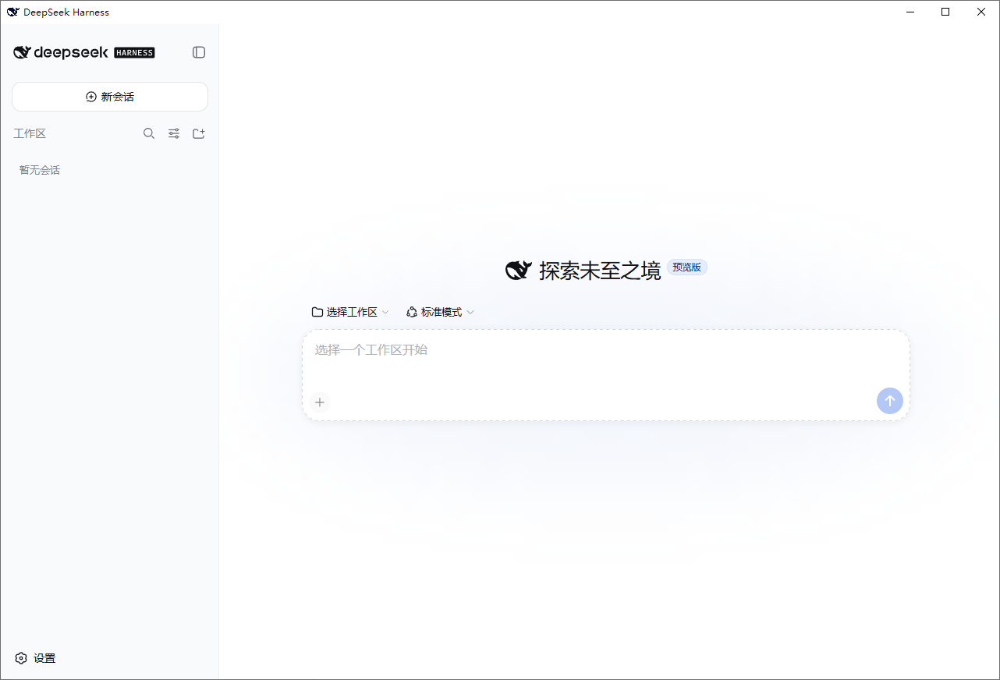

# dsh-launcher

[简体中文](README.md) · [English](README.en.md)

[](https://github.com/Ruler4396/dsh-launcher/actions/workflows/build.yml)
[](LICENSE)
[](https://github.com/Ruler4396/dsh-launcher/releases)

> A lightweight Windows launcher for DeepSeek Harness: autostart at logon + a small WebView2 window instead of a full browser. Double-click to run — no command line needed.



## Install

**Option 1: MSI installer (recommended for beginners)**

1. Download `dsh-launcher-<version>.msi` from [Releases](https://github.com/Ruler4396/dsh-launcher/releases)
2. Double-click and follow the wizard (choose **autostart** / desktop / start menu shortcuts, custom folder supported)
3. Install and uninstall prompt once for **UAC elevation** (per-machine install, default `%ProgramFiles%\dsh-launcher`)
4. Uninstall: Settings → Apps → dsh-launcher (or the "卸载 dsh-launcher" Start Menu entry)

**Option 2: portable ZIP**

1. Download `dsh-launcher-windows.zip` and extract anywhere
2. Run `DshWeb.exe`
3. Uninstall: delete the folder (use `uninstall-autostart.cmd` to remove autostart/shortcuts)

## Requirements

| Dependency | Why | How to get |
|---|---|---|
| **Node.js 18+** | required to run the dsh service (a global dsh install is optional — the launcher falls back to `npx -y @deepseek-ai/dsh`) | https://nodejs.org (LTS, default install) |
| **.NET Desktop Runtime 10** | required to run the shell | if double-click does nothing, run `winget install Microsoft.DotNet.DesktopRuntime.10` |
| **WebView2 Runtime** | renders the window | usually preinstalled on Windows 10/11 |

## Features

- 🚀 **Autostart** — the dsh service starts silently at logon
- 🪟 **Lightweight window** — WebView2 (~50–150MB, freed on close) instead of a full browser
- 🔌 **Auto-launch** — starts the service if not running and waits until ready (first run downloads components, with progress)
- 🔔 **Clear error prompts** — missing Node.js / download failures / port conflicts all show an explicit dialog
- 🎛️ **Service lifetime modes** — tray menu: always-on / tray-resident / follow-window (dsh service memory management)
- 📋 **Logging** — `%USERPROFILE%\.dsh-web.log`

## It won't start? Check by symptom

> Most "nothing happens" cases come from **missing dependencies**. First confirm Node.js and .NET are installed (see Requirements), then check the symptom.

**Symptom 1: double-click does nothing (no window, no dialog)**

Mostly a missing **.NET Desktop Runtime 10**. In PowerShell:

```powershell
winget install Microsoft.DotNet.DesktopRuntime.10
```

Then double-click again. Still nothing → see "View the log" below.

**Symptom 2: dialog "Node.js not detected, cannot start the dsh service"**

Install [Node.js](https://nodejs.org) 18+ (LTS, default options), then **reopen** dsh-launcher.

**Symptom 3: stuck on "starting dsh service… first run downloads components"**

The first run downloads the dsh components via npx — **it can take a few minutes** depending on your network. Wait:
- download finishes → the window opens automatically
- after 3 minutes a dialog explains the reason (slow download / network issue) and shows the log tail

For slow networks you can switch npm to a mirror and retry:

```powershell
npm config set registry https://registry.npmmirror.com
```

**Symptom 4: dialog "dsh service could not be reached" / "service unavailable"**

Open the log and check the last lines: `%USERPROFILE%\.dsh-web.log`

- `npm ERR` or network errors → **network/proxy issue**, retry or change network
- `'npx' is not recognized` → **Node.js is not installed properly**, reinstall (Symptom 2)
- `EADDRINUSE` → **port 3080 is taken**, see Symptom 5

**Symptom 5: port 3080 is used by another program**

Set `DSH_WEB_URL` to another port and restart (the dsh service must listen on the same port — see [docs/DETAILS.md](docs/DETAILS.md)):

```powershell
$env:DSH_WEB_URL = "http://127.0.0.1:3090"
```

**Symptom 6: blurry text/icons at 125%/150% display scaling**

Fixed in v0.1.8 (Per-Monitor DPI) — **upgrade to the latest release**.

**Symptom 7: two dsh-launcher entries in Settings → Apps after upgrading**

The new version detects the old per-user install and offers a **one-click elevated cleanup** (with UpgradeCode verification — it never removes other software). Click Yes.

**View the log:**

```powershell
Get-Content "$env:USERPROFILE\.dsh-web.log" -Tail 30
```

The first log line tells you whether the service was started with a global `dsh` or the `npx` fallback.

## FAQ

**Q: Do I need to run `npx @deepseek-ai/dsh web` manually first?**
No. Since v0.1.2 the launcher falls back to `npx -y @deepseek-ai/dsh` automatically — no global install needed.

**Q: MSI vs ZIP?**
Same contents. MSI adds a standard install/uninstall flow (recommended); ZIP is portable.

**Q: Can I choose the install folder? Will uninstall delete other files in the same folder?**
Yes to custom folder; uninstall only removes the app's own files and keeps a non-empty folder (verified).

**Q: The dsh service keeps using hundreds of MB of memory?**
dsh is a full service (with web UI); staying resident is by design (instant open). To save memory: tray menu → "服务模式" → **跟随窗口 / follow-window** (service stops on window close and is auto-restarted next time).

## More

- Implementation / Security / Release policy / Building from source: [docs/DETAILS.md](docs/DETAILS.md)
- Changelog: [CHANGELOG.md](CHANGELOG.md)

## Disclaimer & License

Independent third-party tool, not affiliated with DeepSeek / DeepSeek AI. The window icon uses the DeepSeek brand mark, copyright of DeepSeek, used locally only. [MIT](LICENSE) © dsh-launcher contributors
