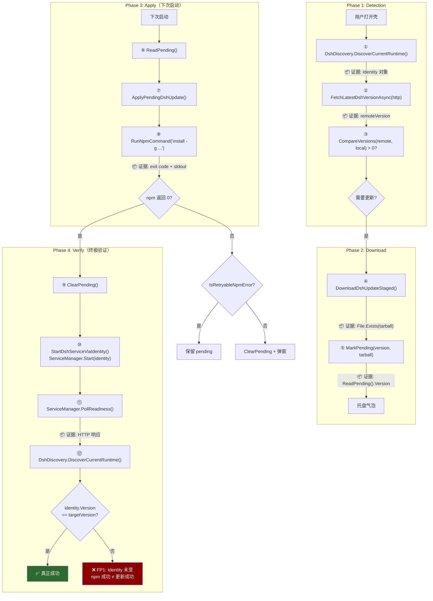
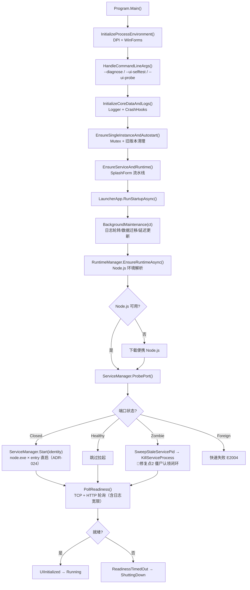
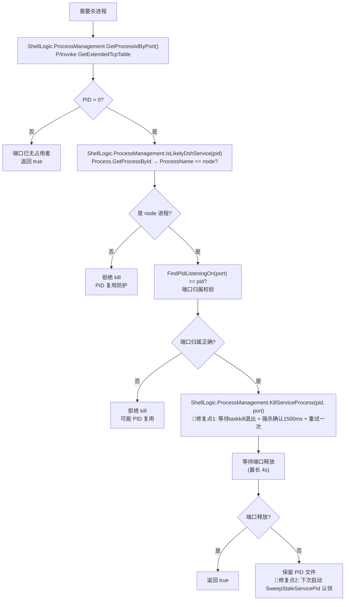
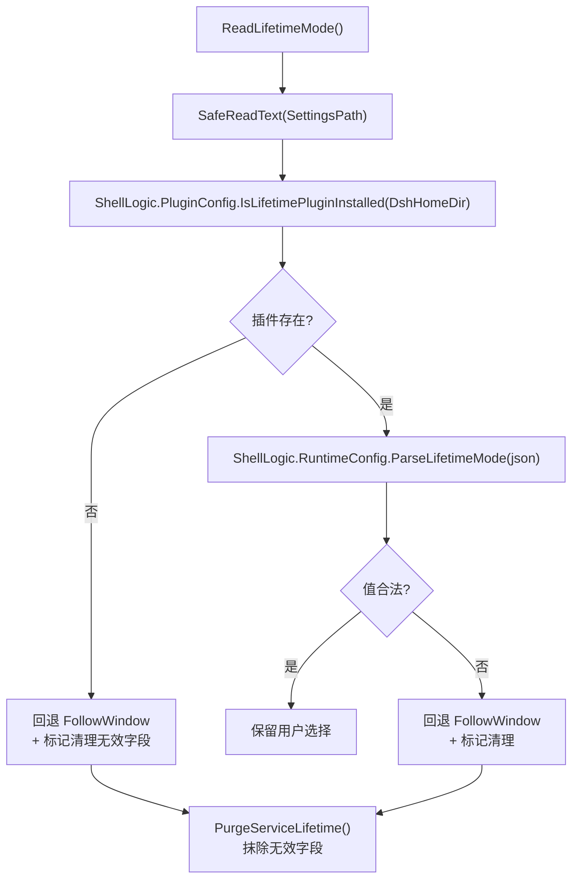
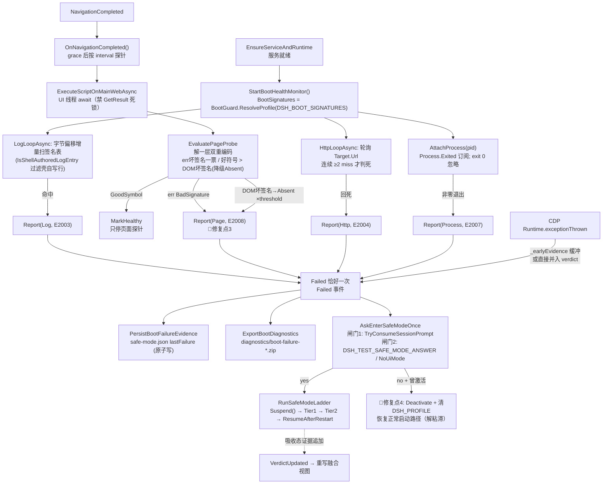

# 系统因果地图（System Causal Map）

> **铁律**：修复任何跨模块 Bug 时，Agent **必须**先在本地图中定位 Bug 发生的节点，
> 并检查上下游的身份传递（`DshRuntimeIdentity`）是否一致。

---

## 0. v0.4.x 用户回归修复批注（2026-09：静默失败 / 开窗慢 / Release 空日志）

> 本次修复在因果链中的落点与身份一致性检查记录（铁律第 3 步要求）。

### 落点 1：启动编排链（"点击很久才有窗口"）
```
双击 → [Stage4 单实例] → Splash(OnShown 后台流水线)
     → EnsureRuntime → 探测端口 → 拉起(vbs) → WaitServiceReady
     → 【修复①】LauncherApp 就绪预算判定不再于 UI 续体同步 DiscoverCurrentRuntime()
       （全局安装场景 spawn node --version 数百 ms～3s 曾冻结 Splash）
     → Splash 关闭 → 【修复②】EnsureServiceAndRuntime 尾部：
       · 回滚武装 ArmUpdateRollbackGuardFromPersistedState 移入 Task.Run（内含身份发现）
       · 删除重复 PortOpen 同步终检（就绪真相源 = 流水线 outcome.Ready 的 TCP+HTTP 双探针）
     → 建主窗（目标 ≤300ms）
```
**身份传递检查**：WaitServiceReady 的预算判定仍读 `DiscoverCurrentRuntime().Source`；
发现层只记忆化**昂贵版本探测**（ProbeVersionOutput），`DSH_VERSION` 钩子保持每次即时生效，
UpdateChecker/ReadGlobalDshVersion/vbs 三级回退链语义零变化。

### 落点 2：首装链（无 dsh → "静默失败"）
```
Source==NpxCache →【改道】TryEnsureGlobalDshInstalled：
  npm install -g @deepseek-ai/dsh@<ver|latest>
  · 共享预算 ShellLogic.ProvisionPolicy（600s 总额/420s 单源/剩余<60s 放弃）
  · 换源边界 → Splash 黄色告警文案（降级可见化）
  · 成功 → DshDiscovery.InvalidateCache() → StartDshServiceViaVbs（发现链立见新 shim）
  · 失败 → 返回 false（不落 npx 冷路径）→ HandleStartupFailure 经
    StartupFailurePolicy 映射为 [E1012] 展示真实根因
```
**身份一致性**：安装成功必调 InvalidateCache——否则 WaitServiceReady 会按 NpxCache 误用
360s 预算、UpdateChecker 读到旧版本。旧 SelfContained staging 双份构建代码已删除；
更新引擎（DownloadDshUpdateStaged→staging 构建→原子应用）不受影响。

### 落点 3：单实例与崩溃出口（"双击没反应/无声消失"）
```
第二实例：等待主窗 20s→5s；超时弹 [E1009] Info（不再静默 return false）
AppDomain.UnhandledException：写 E9001 日志后 TryShowFatalDialog 可见化（非无头模式）
```

### 落点 4：发布链（Release 正文为占位符）
```
tag v0.4.0 首推指向无 changelog 小节的提交 → fallback 文案被发布；
事后强移 tag 触发的 CI 因测试红未能刷新 Release。
根治：build.yml 发布 job 对缺失条目 exit 1（fail-fast 闸门）；CI 测试红修复；
流程纪律见 .github/CONTRIBUTING.md「发布流程与 tag 纪律」。
```

---

## 0.1 v0.4.6 issue #28 修复批注（2026-09：版本徽标闪退 / 托盘退出条目 / 运行期重启弹窗 / 伪重启）

> 铁律第 1/3 步：先定位 Bug 节点，再标修复点并检查上下游身份传递。

### 落点 1：版本信息窗崩溃链（"点版本号卡死→闪退"，P0）
```
CustomTitleBar.OnMouseDown（版本徽标命中）
  → Program.ShowVersionInfoDialog → VersionInfoDialog.ShowDialog(owner)
  → 【崩溃节点】WinForms 焦点变化 → Control.WmSetFocus / WmImeKillFocus
     → ImeContext.SetImeStatus(ImeMode) → ImeContext.Disable/Enable
     → ImmSetOpenStatus(第三方 IME 的无效 HIMC) → native AV 0xc0000005（coreclr 内）
     → 进程 fail-fast（E9001 都来不及写）→ 被用户描述为"闪退"
  → 【修复点】Win32/ImeContextGuard.Harden(form)：句柄创建即 ImmAssociateContext(hwnd, NULL)
     → ImeContext.GetImeMode(hwnd) == Disable、IsOpen(hwnd) == false
     → UpdateImeContextMode 短路 / Disable() 跳过 SetOpenStatus / PropagatingImeMode 不初始化
     → ImmSetOpenStatus 路径整体不可达
```
**证据**：事件日志 Application Error 1000（DshWeb.exe / 异常 0xc0000005 / 故障模块 coreclr.dll）
+ .NET Runtime 1026 托管栈（两条路径见 CHANGELOG）；`dsh.log` 中 14:17:20 版本弹窗拉取成功
与 14:17:24 崩溃时间戳吻合，且两次崩溃栈都含 `ShowVersionInfoDialog ← OnMouseDown`。
**身份传递检查**：本修复不触碰 `DshRuntimeIdentity`/版本发现链，仅改 UI 层的 IME 上下文归属；
`DshDiscovery` → `VersionInfoDialog` 的当前版本入参语义不变。
**回归测试**：`Regression_Issue28_ImeContextCrash.RealOs`（真实 imm32 + 真实窗体/弹窗，零 Mock）。

### 落点 2：运行期服务退出 → 启动自检弹窗（issue #28 第 2 点）
```
用户点 DSH 自带重启按钮 → node 服务进程退出
  → 【误判节点】BootHealthMonitor.OnProcessExited → Report(E2007) → HandleBootHealthFailed
     → "dsh 启动自检未通过（[E2007]）… 是否重启 dsh 服务？" 弹窗（用户看到的"异常弹窗"）
  → 【修复点】_state == Healthy 时改抛 ServiceExitedWhileRunning
     → Program.HandleRuntimeServiceExit：Suspend（探针不判死）→ RestartDshServiceCoreAsync
        （停服 → StartDshServiceViaIdentity → WaitForFreshServiceToken → 就绪 → ResumeAfterRestart）
     → 页面重新导航；失败或冷却窗内超 3 次才升级为可见询问
```
**身份传递检查**：重启仍走唯一身份入口 `StartDshServiceViaIdentity()`（`DiscoverCurrentRuntime`
→ `ServiceManager.Start(identity)`），与更新应用/安全模式切换同源；未新增旁路拉起。
**[issue #28-4 补强]** 该入口的 profile 判定不再内联，改走 `Domain/SafeModeLaunchPolicy.Decorate`
——与 `LauncherApp.ServiceIdentityDecorator`（初始拉起）**同源**，"唯一身份入口"这句从此全真；
且四条重启路径（运行期自愈/安全模式/回滚/更新应用）就绪后一律 `RecordServicePid()` 刷新账本 +
内存 `_servicePid`，再 `ResumeAfterRestart(pid)`——账本停留在已死旧 pid 会让下一次退出被误判成
启动自检失败（见落点 5）。
**[同族二阶缺口，见落点 5 缺陷 E]** "同源"最初只做到 `Decorate` 一层：`Decorate` 假设隔离
profile 物理存在，而"缺目录先重建 / 重建失败退回正常模式"这步 ensure 一开始只补在重启路径 →
初始启动仍会带着不存在的 `--profile` 拉起并硬失败。现启动钩子与重启路径共同引用组合根
**单一入口** `Program.EnsureSafeProfileIdentity`（`scripts/test.ps1` 静态门锁定
`SafeModeLaunchPolicy.Decorate` 在 `Program.cs` 只有 1 处调用点）。
**回归测试**：`Regression_Issue28_RuntimeServiceRestartTests`（Healthy 前后退出语义 + 幂等闸门复位）
+ `Regression_Issue28_RestartPidLedgerRefresh.RealOs`（真实进程句柄下"attach 哪个 pid 决定路由"）。

### 落点 3：启动接管残留服务 → 伪重启（issue #28 第 3 点）
```
启动 → Splash 流水线 → ServiceManager.ProbePort == Healthy（端口上已有 node 服务）
  → 【误判节点】needsStart=false → ServiceStartedByShell=false → Program.TryAdoptOrphanService
     → 沿用上次会话的旧 node（插件/配置改动永不生效；关窗重开"秒进"）
  → 【修复点】LauncherApp.RestartHealthyLeftoverPolicy（组合根注入）
     = ShouldRestartLeftoverService(驻留模式) × 账本内 PID × 非外部托管
     → KillZombieTree（就地清理）→ 按正常链路重新拉起 → ServiceStartedByShell=true
```
**身份传递检查**：账本判定复用 `ServiceLifecycleOps.PidFilePath`（与 `TryAdoptOrphanService`
同一账本，不新增第二真相源）；清理只针对账本内 PID，账本外 node 沿用 F4"绝不误杀"铁律。
**回归测试**：`ShellLogicServiceLifecycleTests.ShouldRestartLeftoverService_Matrix` +
`LauncherAppScenarioTests`（清理重启/沿用/清理失败保底 三例）。

### 落点 4：托盘"退出"条目字距异常（issue #28 第 1 点）
```
TrayMenuForm.Draw → 【缺陷节点】TextRenderer 默认内边距（每字两侧 ~4-5px）
  + 首字矩形额外 +4*s → 字距被放大成 ≈11px(1x)/22px(2x)
  → 【修复点】NoPadding 测量与绘制 + 纯函数 ShellLogic.TrayMenuLayout.PlaceExitRow
```
**回归测试**：`TrayMenuLayoutContractTests`（字距精确/居中）+ `Regression_Issue28_TrayExitRow.RealOs`
（真实渲染像素：两字墨迹空档 ≤ 半个字宽；回退旧实现必红）。

### 落点 5：DSH 内置重启后插件消失（issue #28 复测第 5 条，重大）
```
用户装完插件 → 点 DSH 页面自带"重启" → node 服务自我退出并重新拉起
  → 【缺陷 A：不对称】WithProfile(.dsh-safe) 全仓唯一判定只在重启路径
     （Program.StartDshServiceViaIdentity），初始启动走 LauncherApp 完全不套
     → 同一份粘滞 safe-mode.json 下"托盘退出重开插件都在、点内置重启插件消失"
       （.dsh-safe 按设计剥离所有非 @deepseek-ai bundle），且重启路径不写横幅 → 全程静默
  → 【缺陷 B：账本】RestartDshServiceCoreAsync 就绪后从不 RecordServicePid
     → ResumeAfterRestart attach 到已死的旧 pid（attach 失败按设计只 Warn）
     → 新服务脱离进程层监控且不在账本 → 下一次重启不再走 ServiceExitedWhileRunning 自愈，
       而被 HTTP 层判 E2004 / 进程层判 E2007 → RegisterBootFailure
       → BootRecoveryPolicy.Decide(pluginInvolved=true) → 询问进安全模式 → 回到缺陷 A（自我强化）
  → 【缺陷 C：截断】StopService 发现端口被"另一个 pid"占据 → 无条件 taskkill /T /F 整树
     → 那棵子树里可能正在跑 npm/pnpm 完成插件安装（全仓唯一能把安装"打断"而非"隐藏"的机制）
  → 【缺陷 D：销毁】正常模式启动无条件 Directory.Delete(.dsh-safe, recursive)
     → 安全模式会话里装的插件被物理销毁
  → 【缺陷 E：被困（真机端到端实测）】粘滞标志 active，但 profiles/.dsh-safe 实际不在
     → Decorate 照旧套 --profile .dsh-safe → dsh "profile \".dsh-safe\" does not exist"
       → exit 1 → 壳 E2002 service-exited → 用户连界面都进不去，"退出安全模式"的入口永远点不到
       （与 issue #25 同一类陷阱：入口不可用 = 被困）
  → 【修复点】SafeModeLaunchPolicy（启动/重启同源）+ ApplySafeModeVisibility（横幅按真正
     拉起进程的身份）+ 可点击退出的通知（该通知 **sticky 不自动收起**：它是降级态唯一退出入口）；
     四条重启路径统一刷新账本；
     ServiceRestartPolicy.DecideOccupantReclaim（应答中的新服务→接管，绝不杀）；
     BootRecoveryPolicy.SuppressLauncherInduced（壳自己造成的空窗不计失败，仅 HTTP 证据 + 20s 窗）；
     SafeProfileCleanupPolicy + InspectForCleanup（有非壳产物就保留）；
     Program.EnsureSafeProfileIdentity（缺目录先 Build(SafeMode.Tier)，重建失败则
     SafeMode.Deactivate() 退回正常模式——界面可用优先于插件可用）
```
**身份传递检查**：`SafeModeLaunchPolicy.Decorate` 只允许改写 `ProfilePath`，其余身份事实
（Source/NodeExePath/入口/版本）逐位传递——契约测试 `SafeModeLaunchPolicyContractTests` 锁死；
`SafeModeSymmetryOutcomes` 进一步断言"启动与重启的 `ServiceLaunch.BuildArgs` 输出字节相等"。
`Decorate` 的**前置条件**（隔离 profile 物理存在）由同一入口内的
`NeedsRebuild(safeModeActive, profileExists)` / `ShouldFallBackToNormal(rebuilt)` 两个纯函数把关，
退回正常模式后 `Decorate` 必须不再套 profile（`Decorate_AfterFallback_DoesNotAttachProfile`）。
**回归测试**：`ShellLogicRestartPolicyContractTests`（决策矩阵）+
`LauncherAppScenarioTests.*_28`（粘滞态装饰启动身份）+ `Outcomes/SafeModeSymmetryOutcomes` +
`Lifecycle/Regression_Issue28_RestartPidLedgerRefresh.RealOs`（真 node/真账本/孙进程存活正负对照）。
**人工验证配方**（须在 `sandbox/<场景名>/` 隔离 DSH_HOME 下跑，核心约束六）：
① 手工把 `<沙盒 home>/dsh-launcher/safe-mode.json` 置 `{"active":true,"tier":1}`（DSH_HOME
即沙盒 home，路径为 `<DSH_HOME>\dsh-launcher\safe-mode.json`）→ 启动 →
标题栏必须出现「（安全模式）」且弹出可点击退出的通知（修复前：静默、无横幅）；
② 页面内点 DSH 自带"重启" → 日志仍为 `service start via identity (SAFE profile)`、
横幅不消失（对称遵守）；点通知退出安全模式 → 重启后命令行回到 `web`；
③ 连续点两次内置重启 → 日志出现两次
`service exited while healthy ... handing over to runtime restart supervision`、
**无** E2004/E2007，且 `service-pid-<port>.txt` 每次重启后内容都变（账本跟上新进程）；
④ 在安全模式会话里装一个插件后正常启动 → `.dsh-safe` 目录必须存活并留痕
`[E1010] 隔离 profile 中存在非壳生成的内容…已保留目录不删`；
⑤ 缺陷 E（缺目录被困）用 `sandbox/issue25-card/e2e-safemode.ps1` 跑真 dsh 全链路：粘滞标志在、
`.dsh-safe` 不在 → 日志出现 `SAFEMODE: sticky profile missing → rebuilt before launch`、界面照常
进入并挂出 **sticky 卡片（35s 后仍在）** → 真实鼠标点击卡片动作 → `SAFEMODE: user exited safe mode
via notice` → 以 `web` 重新拉起 → `safe-mode.json` 回到 `active:false`、横幅撤下。
注意：空 DSH_HOME 即可复现（实测 dsh 会自己 bootstrap `profiles/`，唯一永远不会出现的正是
`.dsh-safe`），无需克隆用户 profiles；沙盒里要钉住 `DSH_TEST_INSTALL_MODE=msi`，否则便携分支的
更新提示是**模态是/否对话框**，会盖住卡片、把点击吃掉（那是测试形态干扰，不是产品缺陷）。

### 落点 6：源码构建被误报"需要安全更新"（issue #28 复测第 2 条）
```
源码构建（无 CI 注入版本号）→ AssemblyInformationalVersion = 1.0.0+sha
  → StripDevDefaultVersion → null → ProbeGitDescribeVersion（无 .git / git 不可用 / 超时 → null）
  → 【误判节点】CompareVersions("0.4.5", null)：VersionPolicy 对未知 fail-open 成 0.0.0 → "有更新"
     （弹窗文案 "当前 ?" 即 null 的物理证据）
  → 【修复点】LauncherUpdateNoticePolicy.ShouldNotifyLauncherSecurity：本地未知一律静默 + Trace 留痕；
     git describe 去掉 --abbrev=0 保留距离尾段，VersionPolicy 把 -<n>-g<sha>[-dirty]
     定义为 post-release dev 构建（排在同名正式版之上）→ 源码构建不再被判旧
```
**身份传递检查**：全系统唯一比较器不变（无调用点特例）；`VersionInfoPolicy` 的
"本地未知 → 有新版本"展示语义按约定保持（被 `VersionInfoPolicyContractTests` +
`Outcomes/VersionInfoOutcomes` 锁定），只有**通知**这一侧收紧。
**回归测试**：`ShellLogicVersionPolicyContractTests`（距离尾段排序 + 通知门矩阵 +
`ParseDescribeOutput`）。

### 落点 7：高 DPI 双缺陷（issue #28 复测第 3/4 条）
```
托盘菜单：字号 = GraphicsUnit.Point 且已乘 _s → 绘制 DC 自带 DPI 再折算一次 → 文字按 s² 放大
  （卡片/图标按 s）；_s 又在构造时 CreateGraphics() 采样 → 恒取主屏 DPI，混屏副屏全错
Splash 窗：全仓唯一零 DPI 处理窗口——380×180 / 60×22 硬编码物理像素 + point 字体
  → 高 DPI 下文字撑破按钮（"按钮基本看不到"）
  → 【修复点】几何与字号折算一律下沉纯函数（TrayMenuLayout.ComputeGeometry /
     SplashLayout.Compute：dpi → 物理像素，只折算一次）；渲染侧像素单位 + 画布钉 96 DPI；
     缩放来源改为按光标所在显示器的 Win32/MonitorDpi.GetForPoint + OnDpiChanged 重算；
     PlaceExitRow 溢出钳制（图标不再画到白卡片外）
```
**CI 可验性口径**：runner 是 96 DPI 且本仓库已放弃在 CI 模拟虚拟显示器
（见 `.github/workflows/e2e-multimon.yml`：多屏/缩放边界回归全部迁移为 Headless 纯函数）。
因此"目标 DPI"必须是**构造参数**而非宿主事实——`Regression_Issue28_TrayMenuHighDpi.RealOs`
用 `Bitmap.SetResolution` 指定画布 DPI，在 96 DPI runner 上也能证明"同一菜单在 96/192 画布上
墨迹宽度必须一致"。真机 200% 的上屏观感仍需 `sandbox/tray-render --dpi 192` 与
`DshWeb.exe --ui-selftest`（第二遍实测"文字墨迹 ≤ 控件框"）人工对照。
**回归测试**：`TrayMenuLayoutContractTests` + `SplashLayoutContractTests` +
`Regression_Issue28_TrayMenuHighDpi.RealOs` + `UiResponsivenessTests`（派生不变量，
替代抄自缺陷常量的 `>=60x20` 同义反复断言）。

---


用户打开壳 → 检测新版 → 下载 → 下次启动自动安装 → **验证 Identity 真的变了**。

> **Scenario 文档**：`docs/scenarios/update-dsh.md`（含 7 个 False Positive 陷阱详解）



### 观察证据（Evidence）清单

| 节点 | 证据 | 获取方式 | False Positive 陷阱 |
|---|---|---|---|
| ① Identity | `DshRuntimeIdentity` | `DiscoverCurrentRuntime()` | — |
| ② 远端版本 | string | HTTP GET registry | 网络失败 → null → 静默跳过（合理） |
| ③ 比较结果 | int | `CompareVersions()` | FP6: 重复提示（去重逻辑防） |
| ④ tarball | 文件存在 | `File.Exists()` | — |
| ⑤ pending | JSON 记录 | `ReadPending()` | FP7: 死循环（IsRetryableNpmError 防） |
| ⑧ npm 执行 | exit code | `RunNpmCommand` 返回值 | **FP1: exit 0 ≠ Identity 变化** |
| **⑫ 最终 Identity** | **`DshRuntimeIdentity`** | **`DiscoverCurrentRuntime()`** | **FP1: 必须 == targetVersion** |

### False Positives 陷阱

| ID | 陷阱 | 场景 | 拦截方式 |
|---|---|---|---|
| **FP1** | **npm 成功但 Identity 未变** | `npm install -g` 返回 0，但运行的是 npx 缓存 | ⑫ 必须验证 Identity |
| FP2 | npm 成功但装了错误版本 | `install -g` 不带版本号 → latest | `installSpec` 必须精确版本 |
| FP3 | 安装成功但服务未重启 | 旧进程仍在运行 | 先 StopShellService 再 Start |
| FP4 | 服务重启但 HTTP 未就绪 | 新版本启动失败 | WaitServiceReady 超时 |
| FP5 | pending 被清但实际未更新 | ClearPending 在 Identity 验证前 | **先验证 Identity 再 ClearPending** |
| FP6 | 更新成功但重复提示 | 检测走了不同路径 | `_sessionStagedVersions` 去重 |
| FP7 | 更新失败导致死循环 | 不可重试错误未清 pending | `IsRetryableNpmError` 分类 |

**关键身份传递节点**：
- **① → ③**: `identity.Version` 决定"是否有更新"
- **① → ⑧**: `identity.Source` 决定"用什么命令安装"
- **⑩**: `identity.NodeExePath × DshEntryJsPath` 决定启动命令（`ShellLogic.ServiceLaunch.BuildArgs`；ADR-024 后唯一合法来源）
- **⑫**: **终极验证** — Identity 必须等于目标版本（防 FP1；引擎侧由 `LogPostApplyIdentity` 留痕）

**L3 测试保护**：
- `Update_Changes_Actual_Running_Identity`（SystemUpgradeOutcomeContracts）— 验证 ⑫ 的 Identity 物理切换
- `Outcome_Update_NpmSuccess_WithoutIdentityChange_IsFalsePositive` — 专门拦截 FP1
- `Outcome_Update_DetectionAndVerification_UseSameIdentity` — 锁定 ① 和 ⑫ 同源
- **P**: 最终验证必须基于 `DshDiscovery`，而非独立探测

---

## 2. 服务启动因果链

用户双击 `DshWeb.exe` → 服务就绪的完整因果路径。



**关键身份传递节点**：
- **I**: `RuntimeManager.EnsureRuntimeAsync` 产出 `DshRuntimeIdentity`（Source + node × 入口物理要件；ADR-024 唯一真相源）
- **K**: `ServiceManager.ProbePort()` 使用 `ShellLogic.ProcessManagement`（进程身份校验）
- **N**: 启动命令只能由 `Identity.NodeExePath × Identity.DshEntryJsPath` 拼装——旧 `start-dsh.vbs → cmd.exe` 轨道已废除（ADR-024 双轨制门禁守护）

---

## 3. 进程身份校验因果链

杀进程前的安全校验路径（防 PID 复用误杀）。



---

## 4. 配置降级因果链

lifetime 插件缺失时的安全回退路径。



---

## 5. 启动崩溃检测因果链（ADR-023 多源主动拉取融合）

壳坐四个观察位 + CDP 精确采集，`BootHealthMonitor` 三态状态机（Pending/Healthy/Failed）融合判定，failed → 安全模式询问（每会话一次）→ ADR-022 两级阶梯。



### False Positives 陷阱（误报防护验收 Task 3）

| 陷阱 | 场景 | 拦截方式 |
|---|---|---|
| 探针异常 | 服务死亡瞬间 WebView 断连，ExecuteScriptAsync 抛错 | catch → Warn，异常轮不计缺席、绝不判 failed |
| 瞬时 HTTP 抖动 | 端口瞬断/代理抖动 | 连续 ≥2 次 miss 才判死；单次 miss 清零计数 |
| 壳主动重启窗口 | 安全模式 Tier 切换重启服务 | `Suspend()` 屏蔽全部判定并清零计数器，`ResumeAfterRestart` 重挂进程层 |
| 慢启动 | dsh 8s 后才就绪好符号 | grace_ms + absent_threshold 预算（S23：4s+8×1s=12s > 8s 零误报） |
| 旧日志误判 | 上次崩溃的日志残留 | 日志层从监控起点的字节偏移增量扫描，旧内容不参与判定 |
| 壳自写行误判 | E1008 插件崩溃捕获行含坏签名文本 | `IsShellAuthoredLogEntry`：JSON 行带 `"code":"E####"` 契约字段 → 跳过 |
| 好符号遮蔽真崩溃 | boot 标志先设、插件后崩 | 坏签名优先于好符号判定 |
| exit code 0 | 壳主动停止服务 | 进程层忽略 exit 0（降级 Warn） |

### 观察证据落点

- 统一日志：`[boot-monitor]` 前缀全层轨迹（armed/probe round/FAILED/HEALTHY/evidence appended）
- `safe-mode.json`：`lastFailure.{utc,code,summary,layers[]}`（四层融合视图，VerdictUpdated 重写）
- `diagnostics/boot-failure-*.zip`：log-warn.txt/state.txt/errors.txt
- 沙盒验收：`sandbox/verify-bootmonitor.ps1 S20–S24`

---

## 5. 2026-08 三处修复点（E2008 误判 / 僵尸清扫 / 安全模式粘滞）

经日志取证锁定的三处代码级根因与修复点（详见提交记录）：

| 修复点 | 现象 | 根因 | 修复 | 回归测试 |
|---|---|---|---|---|
| **修复点1** | 强杀后端口仍被占 / E2005 | `KillProcess` 仅发 taskkill 即轮询（未等 taskkill 退出），确认窗口仅 300ms 存在竞态 | 业务逻辑下沉为 `ShellLogic.ProcessManagement.KillServiceProcess(pid, port)`：`RunTaskKill` 封装（cmd 包装+重定向+超时 Kill 整树）等待 taskkill 退出；温和 `taskkill /T` → 800ms → 强杀 `taskkill /T /F` → 确认 1500ms → 重试一次；失败响亮上报 E2005 并保留 pid 文件 | `Regression_BootLifecycle.RealOs.RealOs_KillServiceProcess_TerminatesLiveListener_AndFreesPort`、`..._RefusesWrongPort_NoMisKill` |
| **修复点2** | 下次启动 E2005 端口占用（僵尸进程） | `SweepStaleServicePid` 缺失「活着且监听目标端口」认领分支（真僵尸直接落空） | `SweepStaleServicePid` 补该分支 → 调 `KillServiceProcess` 认领（内部 IsLikelyDshService + 端口归属双重防误杀）；`StopShellService` 端口释放超时后反查占用者按同样校验清理 | （认领构件即修复点1 的 RealOS 测试；`KillServiceProcess` 可靠终止真实监听进程即启动清扫闭环核心） |
| **修复点3** | E2008 误判（真实 UI 已渲染却被判死） | body.innerText 含字面量坏签名（如 "bootstrap facade is missing"）被一票判死；threshold 仅用于好符号缺席，无「实质内容已渲染」豁免 | `EvaluatePageProbe` 语义调整：err 原文坏签名仍一票 BadSignature（保留 S22 快速捕获）；`good` 符号 → GoodSymbol（渲染豁免）；仅 DOM 文本坏签名（且未确认渲染）→ 降级 Absent 携带 `dom-suspect[签名]=原文摘录`，由 `BootHealthMonitor` 按 AbsentThreshold 连续计次才判死 | `BootGuardContractTests.*DomSuspect*`、`BootHealthMonitorTests.PageLayer_DomBadSignature_*`、`PageLayer_ErrBadSignature_StillFailsImmediately` |
| **修复点4** | 安全模式粘滞（静默降级 .dsh-safe） | 用户答 "no" 后 `safe-mode.json`（tier=1, active）未解除，后续会话全部降级启动 | `AskAndMaybeEnterSafeMode` 用户答 "no" 且 `SafeMode.IsActive` 时执行 `Deactivate()` + 清除 `DSH_PROFILE` 环境变量 + Trace 记录，恢复正常启动路径 | `SafeModeStateTests.Activate_Then_Deactivate_PersistsRoundTrip` |

**关键决策权衡**：不重新引入 CTRL_BREAK（误杀用户 shell 风险 > 收益）；不改 `BootProfile` 默认 grace/threshold（只修判定语义）；不削弱 `scripts/test.ps1` 静态断言。

---

## 6. 2026-08-25 插件致崩 × 安全模式失灵（五处修复点）

> 事故：4 个第三方插件（dsh-launcher-lifetime / dsh-notification / dsh-web-search-anysearch /
> dsh-zh-guide）+ cordis.patch.yml 的 `id: web → searchProvider: anysearch` 补丁把 node 服务进程
> 搞崩（就绪后 ~0.5s exit=1）。BootHealthMonitor 三次会话全部判死成功并落盘，但安全模式
> 从未被询问——用户被迫手工改 package.json 与补丁才恢复。取证：`safe-mode.json` lastFailure、
> diagnostics/boot-failure-20260825-05*.zip ×4、dsh.log（三次 restart-service ask，零次 safe-mode ask）。

| # | 节点（§5 因果链） | 根因 | 修复 | 回归测试 |
|---|---|---|---|---|
| **修复点5** | Report(Process E2007) → HandleBootHealthFailed → 分类闸门 | `VerdictIndicatesPluginInvolvement` 只认页面层坏签名与插件 WebMessage；服务端崩溃无前端证据 ⇒ 永远路由"重启服务" | 归因通道扩展：日志层插件签名命中（`BootGuard.LogEvidenceIndicatesPlugin`）+ 第三方插件在场且进程层崩溃（`PluginConfig.ProfileHasThirdPartyBundles`）；路由决策下沉纯函数 `ShellLogic.BootRecoveryPolicy.Decide` | `BootFailureRoutingContractTests`、`Outcomes/BootFailureRoutingOutcomes` |
| **修复点6** | ServiceManager.Start（§2 服务启动链 N 的直启构件） | `using var p` 在 Start 返回即 Dispose 进程对象 → stdout/stderr 异步排空失效，服务输出从未落统一日志，日志层全程失明（连健康启动的 `dsh web:` 都消失） | 进程对象改静态追踪（`TrackServiceProcess`），下次启动替换时才释放旧对象；Dispose 不杀进程语义不变 | `Regression_ServiceOutputPipe.RealOs.RealOs_ServiceStdoutAndStderr_ArePipedToUnifiedLog` |
| **修复点7** | HandleBootHealthFailed 分支询问出口 | 匿名失败重复 N 次仍只问同一个无效的"重启吗"；事故形态是每次重开壳再崩，会话内闸门抓不住 | `SafeModeState.ConsecutiveBootFailures` 跨会话持久计数（Failed 恰好一次路径 `RegisterBootFailure` 推进，吸收态 VerdictUpdated 重写不推进；`HealthyDetected` 接线 `ResetFailureStreak` 复位）；连续 ≥3 次匿名失败升级安全模式询问 | `SafeModeStateTests.FailureStreak_*`、`Outcome_AnonymousCrashLoop_Escalates…` |
| **修复点8** | §3 进程终止链 KillServiceProcess 身份校验分支 | 已崩溃 pid 再次停止时 GetProcessById 抛异常被归因为 "not a dsh service process"（Warn+false），pid 文件滞留 | 区分"已消失无需杀"（Info+true，调用方走端口释放等待并清 pid 文件）与"活着但不是 node"（真防误杀拒绝不变） | `RealOs_KillServiceProcess_DeadPid_ReportsSuccess_NothingToKill`、`…_LiveNonNodeProcess_StillRefused` |
| **修复点9** | else 分支弹窗文案 | 无插件证据分支硬编码 E2008 文案（"页面启动自检未通过"），进程层崩溃也显示该文案误导排障 | headline 改为按裁决 ErrorCode 动态生成（`ErrorCodes.Describe(verdict.ErrorCode)`） | 弹窗文案属 UI 路径，由 TestHook E2E 覆盖（后续） |

**身份一致性检查**：修复点6 只改变进程对象生命周期，启动命令仍由
`Identity.NodeExePath × DshEntryJsPath` 经 `BuildArgs` 唯一拼装（ADR-024 不变）；
修复点7 的持久化文件仍是 safe-mode.json（原子写），安全模式激活/粘滞解除语义（修复点4）不变。

---

## 7. 2026-11 [E2007/E2008 误报根治]：配置等待态不判死 + 残留 pid attach 不判死

用户实测形态：未配置 API key 启动 → dsh 渲染出自己的欢迎/配置界面（boot 链未完成，
`__ModuleLoader__.mode` 不为 `"live"`）→ 页面层好符号持续缺席被误判 E2008；弹窗证据同时出现
`[Process] 进程 attach 失败（pid=4708 不存在）`（残留 pid 被当成进程崩溃证据），点"重启"后循环复发
（重启询问不受每会话一次闸门约束）。『页面其实是好的，只有真 failed 才该报错』。

| # | 节点（§5 因果链） | 根因 | 修复 | 回归测试 |
|---|---|---|---|---|
| **修复点10** | AttachProcess catch（进程层接线） | 残留/失效 pid 使 `RealProcessHandle` 构造（GetProcessById）抛错，却被 `Report(Process, E2007)` 判死整监控并弹窗——attach 是 best-effort 监视接线，不是崩溃裁决 | catch 仅 `Logger.Warn`，不再 Report（无错误码 → 无状态转移）；服务真死由 HTTP 层（E2004 连续 miss）与页面层（缺席阈值 E2008）兜底 | `BootHealthMonitorTests.ProcessLayer_AttachFactoryThrows_WarnsOnly_NeverFails`、`Regression_StalePidAttachTests.RealOs`、`Outcomes.ConfigurationWaitingState…` |
| **修复点11** | `EvaluatePageProbe` 缺席分支（页面层主触发器） | 好符号判定只认 boot 链完成（mode==="live"）；页面已渲染出 dsh 自身 UI（配置/欢迎界面）但 boot 链未完成 → 连续 `absent_threshold` 次缺席 → E2008 误报 | 新增 `Rendered` 分类：err 坏签名一票 / DOM 坏签名计票 / good 优先序不变，其后 `innerText ≥ RenderedMinTextChars(默认60，DSH_BOOT_SIGNATURES.rendered_min_text_chars 可覆盖)` 且无坏签名 → `Rendered` → Healthy；空白/纯加载页仍走缺席计票（慢启动保护不削弱） | `BootGuardContractTests.*Rendered*`、`BootHealthMonitorTests.PageLayer_RenderedContent_Healthy_ProbesStop`、`…_ShortTextBelowRenderedThreshold_StillAbsent…`、`Outcomes.ConfigWaitingStateOutcomes` |

**决策权衡**：渲染豁免采用代理特征（innerText 长度）而非精确 UI 断言——探针协议不变、向后兼容；
坏签名优先级置于豁免之上（err 一票 / DOM 计票），真崩溃错误 UI 不会被豁免；阈值默认 60 且可由
`DSH_BOOT_SIGNATURES` 校准，避免空页面被豁免。
**身份一致性检查**：修复点11 只调整探针求值语义，探针脚本形状（{good,text,err}）与
`BuildProbeScript` 不变；`HealthyDetected` 的 `ResetFailureStreak` 接线（修复点7）复用，配置等待态
计入"健康"不推进失败计数。修复点10 不触碰 `OnProcessExited` 的 Exited 事件路径（真崩溃 E2007 仍在）。

---

## 8. 2026-08-29 [token 栅栏]：dsh ≥0.1.2 根路径鉴权 → 壳 WebView 401 挂死（两处修复点）

实测形态（沙盒：官方源码构建的 0.1.2-alpha.1 SelfContained 运行时 × 真壳冷启动）：服务级链路全绿
（发现层选中新版、node 直启、tcp+http 6s 就绪、更新检查不误报），但启动横幅从 0.1.1 的
`dsh web: http://127.0.0.1:P` 变为 `dsh web: http://127.0.0.1:P/?token=…`（web-startup 新增根路径
token 信任栅栏，`--trusted-host` 只放宽 /api 不放宽根路径）。壳 WebView 导航裸 `Target.Url` →
401 错误页（E2004）→ 页面探针 `ExecuteScriptAsync` 永久挂起（派发后再无任何日志）→ 页面层瘫痪：
无 Failed 判定、无恢复询问、HTTP 层又"健康"故 update-guard 回滚也不触发——用户对着死窗口无解。
对照实验：0.1.1-rc.2 根路径 200（无 token），0.1.2-alpha.1 根路径 401。

| # | 节点（§2/§5 因果链） | 根因 | 修复 | 回归测试 |
|---|---|---|---|---|
| **修复点12** | 服务输出管道 → 壳 WebView 导航（§2 尾部） | 管道只把横幅渲染进统一日志，无人消费其中的 token URL；导航恒用裸 `Target.Url`；且 4 处服务重启后的 `Reload()` 停留旧地址（新进程新 token，Reload 必 401） | 新增纯函数 `ShellLogic.ServiceOutput.TryExtractTokenUrl`（宽进严出：http(s)+回环主机+端口匹配+token 非空，防伪造 stdout 劫持导航）；`ServiceManager` 管道逐行解析命中后经**静态**事件 `ServiceTokenUrlObserved` 上抛（identity/DSH_SERVICE_CMD 两条路径分属不同实例，通道必须类级；DSH_SERVICE_CMD 路径同时补齐管道对齐）；组合根记 `_serviceTokenUrl` 并在初始导航、安全模式/回滚/重启/apply 四处刷新点统一走 `NavigateMainWebToCurrentServiceUrl()`（导航替代 Reload） | `ServiceOutputContractTests`、`Regression_WebTokenAuthFence.RealOs`（真实 node 进程全链路） |
| **修复点13** | `PageLoopAsync` 探针轮（§5 页面层） | `await probe(script)` 无界——ExecuteScriptAsync 在 401 错误页永久不返回，单点挂起瘫痪整个页面层且无任何判定 | 每轮 `Task.WhenAny(probeTask, Task.Delay(pageProbeTimeout))`（默认 5s，ctor 可注入）；单次超时只 Warn 不判死（误报防护铁律不破）；**连续**超时达阈值（默认 10，ctor 可注入）→ E2008 判死（页面持续不可用的强证据）；任何成功往返清零连击；Stop() 经取消分支立即返回（挂起探针由 OnlyOnFaulted 续体吸收） | `BootHealthMonitorTests.PageProbe_HangingRounds_TimeoutStreakConvergesToFailed`、`…_TimeoutThenGoodSymbol_StreakReset_Healthy`、`…_HangingForever_StopReturnsPromptly_NoDeadlock` |

**决策权衡**：token 跟随选择"解析服务自报 URL"而非上游加关鉴权旗标——实测 `--trusted-host` 只作用于
/api 栅栏，且解析纯函数带回环+端口双校验后，伪造 stdout 无法把壳 WebView 引出本机。探针超时判死阈值
（10）高于缺席阈值（默认 5）——超时证据弱于缺席（可能只是渲染进程卡顿），宁可晚判不可误杀。
**身份一致性检查**：两修复点均不触碰发现层/身份比较（DshRuntimeIdentity 语义不变）；token URL 仅作
WebView 导航目标，`Target.Port`/就绪探测/健康监控仍用裸 `Target.Url`（401 对 tcp+http 就绪判定无影响，
与沙盒实测一致）。

## 9. 2026-08-29 [签名漂移]：dsh 0.1.2 插件失败面板绕过页面层（修复点14）

实机形态（0.4.2 × dsh 0.1.2-alpha.1 × 用户真实第三方插件）：插件客户端模块加载失败时，dsh 渲染
"Failed to load plugins / failed to import loader entry (dsh-notification)…"面板**替代整个应用 UI**，
但面板页面仍带 ModuleLoader 门面 → 探针 `good=true` 走 GoodSymbol 分支 → **HEALTHY 假阳性**：
无弹窗、无安全模式、用户对着死页。探针其实已把面板全文采进 `text`，但 BadSignatures 还是
0.1.1 时代三签名，0.1.2 失败文案一个不匹配（签名漂移）。

| # | 节点（§5 因果链） | 根因 | 修复 | 回归测试 |
|---|---|---|---|---|
| **修复点14** | `EvaluatePageProbe` 判定顺序 | 好符号分支优先于 DOM 坏签名，且签名表未覆盖 0.1.2 面板文案 | 新增 `FatalPanelSignatures` 通道（默认 `failed to import loader entry`，`DSH_BOOT_SIGNATURES.fatal_panel_signatures` 可覆盖）：**最先**匹配 body 文本、优先于 good，命中即 E2008 一票判死 + `dom[` 证据 → 插件归因 → 安全模式询问 | `BootGuardContractTests.EvaluatePageProbe_PluginFatalPanel_*`（4 例）、`BootHealthMonitorTests.PageProbe_PluginFatalPanel_EvenWithGoodSymbol_FailsWithDomEvidence` |

**决策权衡**：面板命中一票判死而非计票——面板是确定性"应用被插件打断"证据（非瞬时加载态）；误报面
（用户会话文本恰含该文案）自愈成本低（点否即可）。`dsh-launcher-lifetime` 类**类型导入**插件构建后
不含死包引用不受影响；实机处置：摘除 dsh-notification/dsh-zh-guide 出 web profile bundles（依赖保留）。

---

## 10. 2026-09-09 [issue #26]：服务就绪前进程退出 → 180s 盲等 + 误导性 E2002

用户实测形态：MSI 0.4.5 × 全局 dsh（`dsh web` 命令行可正常启动），启动器一直停在
"正在等待 dsh 服务就绪…"，最终弹 E2002"启动超时：可能是首次下载较慢/网络问题"。根因链（§2 R 节点）：
壳拉起 dsh 服务进程 → 进程**就绪前退出**（EADDRINUSE / 引擎内部 TypeError / 入口错误等）→
PollReadiness 只观测 TCP/HTTP + 启动错误标志（`StartupErrorMarkers` 词表，不含 EADDRINUSE 等
通用 node 崩溃形态）→ 日志判定盲、进程退出状态被无视（统一日志里的
`service process exited (code=N)` 就躺在那里）→ 盲等完整预算（180s/360s）→ E2002 误导文案。

| # | 节点（§2 因果链） | 根因 | 修复 | 回归测试 |
|---|---|---|---|---|
| **修复点15** | PollReadiness 轮询循环（§2 R → S{"就绪?"}） | 就绪判定只有 TCP/HTTP/日志三输入，**进程退出观测缺失**：`ServiceManager` 已追踪本会话拉起的进程对象（TrackServiceProcess）且 `Exited` 事件已把退出码落统一日志，但该观测从不参与就绪裁决 | `ServiceManager` 静态追踪器扩展"已退出"标志 + 退出码（`TrackedServiceExitCodeOrMinusOne`）；`PollReadiness` 新增可选退出探针（缺省读追踪器）：TCP/HTTP 未就绪且观测到进程已退出 → 立即返回第五态 `"service-exited"`（不再盲等预算）；组合根 `HandleStartupFailure` 按 `MapVerdictErrorCode` 映射 **E2010**（新码：就绪前退出），弹窗展示真实退出码 + 进程输出首条异常线索 + 日志尾部；清理分支与 timeout/logerror 同集 | `ServiceReadinessContractTests`（裁决串/退出码语义/裁决→错误码映射）、`PollReadinessTests.ServiceProcessExited*`（Fake 探针 + 虚时钟）、`LauncherAppScenarioTests.ServiceExitedBeforeReady_*`（Headless：WaitResult=service-exited + 超时清理触发）、`Regression_Issue26_ServiceExitBeforeReady.RealOs`（零 Mock 真实 node 秒退，断言返回 service-exited 而非 timeout） |

**决策权衡**：退出观测只在"本次会话 Start 拉起的进程"上生效（追踪器替换/复位隔离旧会话），
且就绪（TCP+HTTP）优先于退出观测——服务健康时进程退出观测不适用；logerror 宽限语义不变
（进程已退出是更强的失败证据，无需再等宽限）。**身份一致性检查**：修复点15 不触碰发现层/身份
比较（DshRuntimeIdentity 语义不变），只扩展 `ServiceManager` 进程追踪器与 PollReadiness 裁决输入，
服务启动命令仍由 Identity 经 BuildArgs 唯一拼装（ADR-024 不变）。

---

## 如何使用本地图

### 修 Bug 流程

1. **定位节点**：在因果地图中找到 Bug 发生的节点
2. **检查上游**：上游传入的身份/数据是否正确？
3. **检查下游**：下游消费的身份/数据是否一致？
4. **验证不变量**：该节点的 `[INVARIANT]` 注释是否被违反？

### 新增测试流程

1. **确定因果链**：新功能属于哪条因果链？
2. **确定节点**：在因果链的哪个节点添加测试？
3. **选择测试类型**：
   - 节点级：单元测试（纯函数、可注入）
   - 链级：Outcome Contract 测试（跨越多模块，验证最终状态）

### 身份一致性检查

当修改涉及以下模块时，**必须**检查 `DshRuntimeIdentity` 的传递（ADR-024）：
- `DshDiscovery.DiscoverCurrentRuntime` — 统一发现（唯一合法 Identity 产出点）
- `UpdateChecker.ResolveLocalDshVersion` — 版本检测（必须委托 DshDiscovery，返回 `.Version`）
- `RuntimeManager.EnsureRuntimeAsync` — 身份解析（产出 RuntimeResolution.Identity）
- `ServiceManager.Start(identity, port)` — 服务启动（命令只由 Identity 拼装）
- `DshUpdateManager.HandlePendingAtStartup / ApplyPending` — 更新决策与应用（判定基于 `identity.Version`，应用后 `LogPostApplyIdentity` 取证）
