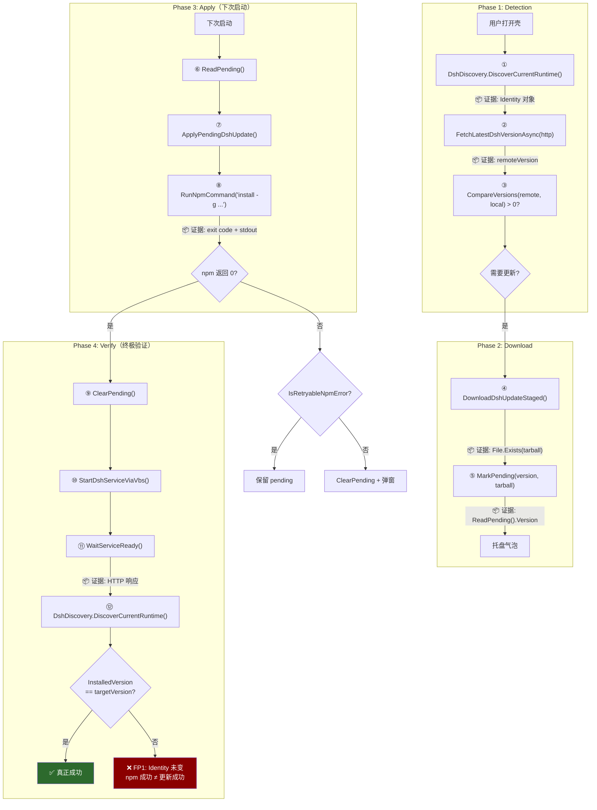
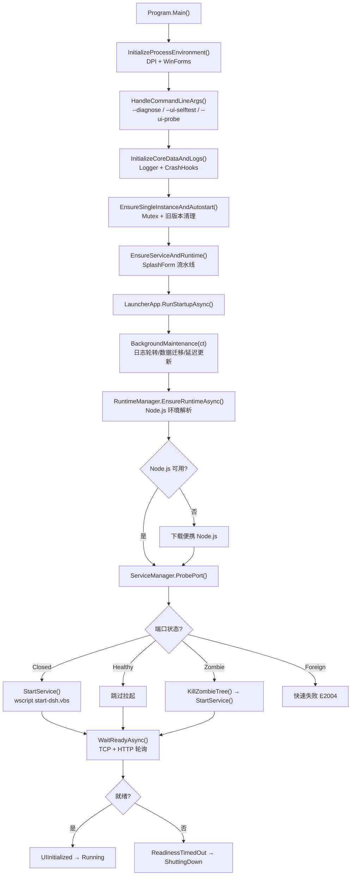
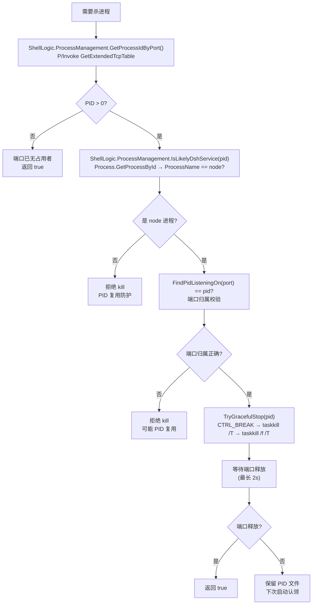
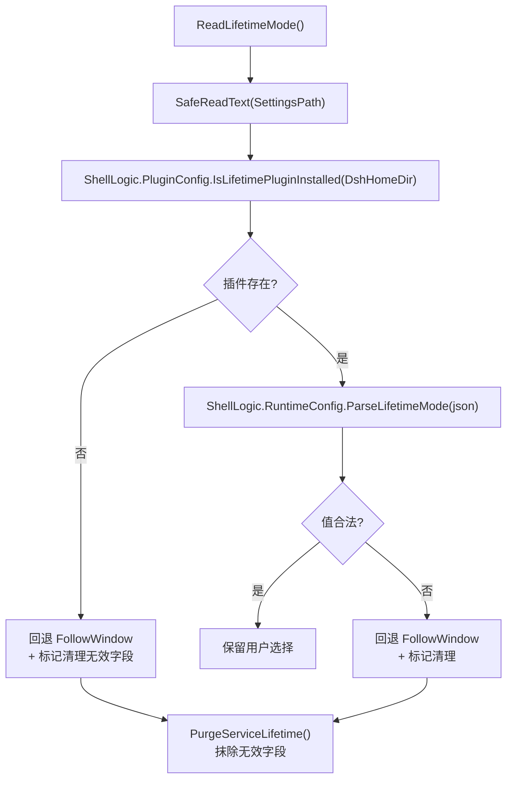

# 系统因果地图（System Causal Map）

> **铁律**：修复任何跨模块 Bug 时，Agent **必须**先在本地图中定位 Bug 发生的节点，
> 并检查上下游的身份传递（`DshRuntimeIdentity`）是否一致。

---

## 1. 自动更新因果链

用户打开壳 → 检测新版 → 下载 → 下次启动自动安装 → **验证 Identity 真的变了**。

> **Scenario 文档**：`docs/scenarios/update-dsh.md`（含 7 个 False Positive 陷阱详解）

### 观察证据（Evidence）清单

| 节点 | 证据 | 获取方式 | False Positive 陷阱 |
|---|---|---|---|
| ① Identity | `DshRuntimeIdentity` | `DiscoverCurrentRuntime()` | — |
| ② 远端版本 | string | HTTP GET registry | 网络失败 → null → 静默跳过（合理） |
| ③ 比较结果 | int | `CompareVersions()` | FP6: 重复提示（去重逻辑防） |
| ④ tarball | 文件存在 | `File.Exists()` | — |
| ⑤ pending | JSON 记录 | `ReadPending()` | FP7: 死循环（IsRetryableNpmError 防） |
| ⑧ npm 执行 | exit code | `RunNpmCommand` 返回值 | **FP1: exit 0 ≠ Identity 变化** |
| **⑫ 最终 Identity** | **`DshRuntimeIdentity`** | **`DiscoverCurrentRuntime()`** | **FP1: 必须 == targetVersion** |

### False Positives 陷阱

| ID | 陷阱 | 场景 | 拦截方式 |
|---|---|---|---|
| **FP1** | **npm 成功但 Identity 未变** | `npm install -g` 返回 0，但运行的是 npx 缓存 | ⑫ 必须验证 Identity |
| FP2 | npm 成功但装了错误版本 | `install -g` 不带版本号 → latest | `installSpec` 必须精确版本 |
| FP3 | 安装成功但服务未重启 | 旧进程仍在运行 | 先 StopShellService 再 Start |
| FP4 | 服务重启但 HTTP 未就绪 | 新版本启动失败 | WaitServiceReady 超时 |
| FP5 | pending 被清但实际未更新 | ClearPending 在 Identity 验证前 | **先验证 Identity 再 ClearPending** |
| FP6 | 更新成功但重复提示 | 检测走了不同路径 | `_sessionStagedVersions` 去重 |
| FP7 | 更新失败导致死循环 | 不可重试错误未清 pending | `IsRetryableNpmError` 分类 |

**关键身份传递节点**：
- **① → ③**: `Identity.InstalledVersion` 决定"是否有更新"
- **① → ⑧**: `Identity.Source` 决定"用什么命令安装"
- **⑩**: `Identity.InvocationCommand` 决定"用什么命令启动服务"
- **⑫**: **终极验证** — Identity 必须等于目标版本（防 FP1）

**L3 测试保护**：
- `Outcome_Update_Changes_Actual_Running_Identity` — 验证 ⑫ 的 Identity 变化
- `Outcome_Update_NpmSuccess_WithoutIdentityChange_IsFalsePositive` — 专门拦截 FP1
- `Outcome_Update_DetectionAndVerification_UseSameIdentity` — 锁定 ① 和 ⑫ 同源
- **P**: 最终验证必须基于 `DshDiscovery`，而非独立探测

---

## 2. 服务启动因果链

用户双击 `DshWeb.exe` → 服务就绪的完整因果路径。

**关键身份传递节点**：
- **I**: `RuntimeResolver.ResolveExisting()` 返回 `NodeEnvironment`（Node.js 身份）
- **K**: `ServiceManager.ProbePort()` 使用 `ShellLogic.ProcessManagement`（进程身份校验）
- **N**: `start-dsh.vbs` 内部的 dsh 发现链（`where dsh` → npm shim → npx）

---

## 3. 进程身份校验因果链

杀进程前的安全校验路径（防 PID 复用误杀）。

---

## 4. 配置降级因果链

lifetime 插件缺失时的安全回退路径。

---

## 如何使用本地图

### 修 Bug 流程

1. **定位节点**：在因果地图中找到 Bug 发生的节点
2. **检查上游**：上游传入的身份/数据是否正确？
3. **检查下游**：下游消费的身份/数据是否一致？
4. **验证不变量**：该节点的 `[INVARIANT]` 注释是否被违反？

### 新增测试流程

1. **确定因果链**：新功能属于哪条因果链？
2. **确定节点**：在因果链的哪个节点添加测试？
3. **选择测试类型**：
   - 节点级：单元测试（纯函数、可注入）
   - 链级：Outcome Contract 测试（跨越多模块，验证最终状态）

### 身份一致性检查

当修改涉及以下模块时，**必须**检查 `DshRuntimeIdentity` 的传递：
- `UpdateChecker` — 版本检测
- `start-dsh.vbs` / `Program.StartDshServiceViaVbs` — 服务启动
- `DshDiscovery` — 统一发现
- `Program.ReadGlobalDshVersion` — 版本读取
- `Program.HandlePendingUpdateAtStartup` — 更新决策
