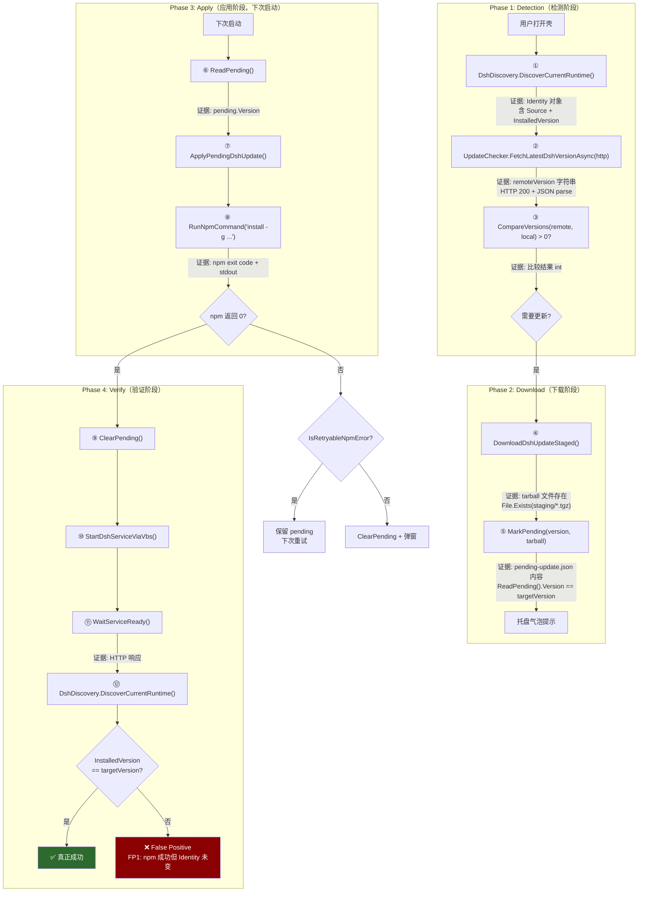

# Scenario: DSH 自动更新

> **因果驱动工程文档** — 由外向内设计，从用户任务出发，推导 Outcome → Invariants → Causal Chain → Evidence → False Positives → Tests。

---

## Trigger

用户打开 dsh-launcher（双击 `DshWeb.exe`），壳在后台异步检测到 `@deepseek-ai/dsh` 有新版本（npm registry latest > 本地版本），用户确认后后台下载，下次启动时自动安装。

---

## Expected Outcome

**唯一成功的定义**：更新事务完成后，系统满足以下两个物理证据：

1. **Identity 匹配**：`DshDiscovery.DiscoverCurrentRuntime().InstalledVersion == targetVersion`
2. **服务可达**：`HTTP GET http://127.0.0.1:{port}` 返回任意响应（含 4xx/5xx）

如果 npm 返回 exit code 0，但 Identity 未改变——**这不是成功，这是 False Positive**。

---

## Required Invariants

| ID | 不变量 | 违反后果 |
|---|---|---|
| **I1** | 检查版本、启动服务、验证结果必须基于同一个 `DshRuntimeIdentity` | "更新了全局包但运行的是 npx 缓存" |
| **I2** | `RunNpmCommand` 返回 true ≠ 更新成功，必须以 Identity 变化为准 | 系统自认为成功但实际未变 |
| **I3** | `remoteVersion > localVersion` 才触发更新，相等或更小绝不触发 | 重复提示/降级安装 |
| **I4** | 更新失败后旧环境必须完整保留，服务必须仍可用 | 用户无法使用 |
| **I5** | `ClearPending()` 必须在 Identity 验证成功之后才调用 | pending 被清但实际未更新 |

---

## Causal Chain

---

## Observations (Evidence)

每个关键节点必须获取的物理证据：

| 节点 | 观察对象 | 获取方式 | 证据类型 |
|---|---|---|---|
| ① 当前身份 | `DshRuntimeIdentity` | `DshDiscovery.DiscoverCurrentRuntime()` | Identity 对象 |
| ② 远端版本 | npm registry JSON | HTTP GET → parse | 字符串 |
| ③ 版本比较 | 比较结果 | `CompareVersions()` | int (-1/0/1) |
| ④ 下载成功 | tarball 文件 | `File.Exists(path)` | bool |
| ⑤ pending 记录 | `pending-update.json` | `ReadPending()` | 记录 |
| ⑧ npm 执行 | exit code + stdout | `RunNpmCommand` 返回值 | bool + string |
| ⑩ 服务启动 | 进程存在 | `Process.Start` 成功 | bool |
| ⑪ HTTP 就绪 | HTTP 响应 | `HttpClient.GetAsync` | 响应 |
| **⑫ 最终身份** | **`DshRuntimeIdentity`** | **`DiscoverCurrentRuntime()`** | **Identity 对象** |

**关键断言**：节点 ⑫ 的 `InstalledVersion` 必须等于节点 ③ 的 `remoteVersion`。这是整个因果链的终极验证。

---

## Failure Modes (False Positives)

### FP1: npm 成功但 Identity 未改变

**场景**：`npm install -g @deepseek-ai/dsh@0.1.0-rc.7` 返回 exit code 0，但实际运行的是 npx 缓存版本。

**根因**：身份错位——安装的是全局包，但 start-dsh.vbs 用的是 npx。

**拦截**：更新后必须调用 `DshDiscovery.DiscoverCurrentRuntime()` 验证 Identity 变化。

**历史**：这是 v0.4.0 审查发现的核心 Bug。已由 `DshRuntimeIdentity` + `DshDiscovery` 从根本上修复。

### FP2: npm 成功但安装了错误版本

**场景**：`npm install -g @deepseek-ai/dsh` (不带版本号) → npm 解析 latest tag → 可能安装了非预期版本。

**根因**：`installSpec` 必须是精确版本（`@deepseek-ai/dsh@0.1.0-rc.7`），而非 latest。

**拦截**：`ApplyPendingDshUpdate` 中 `installSpec` 必须基于 `pending.Version`，而非 latest。

### FP3: 安装成功但服务未重启

**场景**：`npm install -g` 成功，但旧的 node 进程仍在运行（端口仍被占用），新版本未生效。

**根因**：更新后必须重启服务。

**拦截**：`PromptApplyRestart` 中先 `StopShellService()` 再 `StartDshServiceViaVbs()`。

### FP4: 服务重启但 HTTP 未就绪

**场景**：新版本服务启动失败（端口冲突、依赖缺失），HTTP 永远不响应。

**根因**：启动后必须等待 HTTP 就绪。

**拦截**：`WaitServiceReady` 轮询 HTTP 响应，超时返回 false。

### FP5: pending 被清但实际未更新

**场景**：`RunNpmCommand` 返回 true → `ClearPending()` → 但 Identity 验证发现版本未变。

**根因**：`ClearPending()` 在 Identity 验证之前调用。

**拦截**：`ClearPending()` 必须在 `DiscoverCurrentRuntime().InstalledVersion == targetVersion` 之后才调用。

### FP6: 更新成功但重复提示

**场景**：更新成功 → pending 被清 → 但下次启动时检测到"新版本"（因为本地版本检测走了不同路径）。

**根因**：身份错位——检测用 `dsh —version`，启动用 `npx`。已由 `DshDiscovery` 统一。

**拦截**：`ScheduleUpdateCheck` 中的去重逻辑（`_sessionStagedVersions`、`pendingVersion` 比较）。

### FP7: 更新失败导致死循环

**场景**：每次启动都尝试应用同一个失败的更新 → 每次失败 → 每次重新提示。

**根因**：不可重试错误（权限/包损坏）时未清理 pending。

**拦截**：`IsRetryableNpmError` 分类 → 不可重试 → `ClearPending()` + 模态弹窗。

---

## Outcome Tests

| 测试名称 | 保护的 False Positive | 层级 |
|---|---|---|
| `Outcome_Update_Changes_Actual_Running_Identity` | **FP1** (核心) | L3 |
| `Update_Failure_PreservesPending_ForRetry` | FP7 (可重试) | L3 |
| `Update_Failure_NonRetryable_ClearsPending` | FP7 (不可重试) | L3 |
| `Update_Detection_BasedOnActualIdentity` | FP6 (重复提示) | L2 |
| `ResolveLocalDshVersion_UsesDshDiscovery_NotIndependentProbe` | FP1 (身份统一) | L2 |

---

## 七问总结

| 问题 | 答案 |
|---|---|
| 用户任务 | dsh 自动保持最新版本 |
| 成功定义 | `InstalledVersion == targetVersion && HTTP Ready` |
| 核心不变量 | I1(身份一致) + I2(npm exit 0 ≠ 成功) + I5(先验证后清 pending) |
| 因果链 | Detect → Download → Apply → **Verify Identity** |
| 物理证据 | Identity 对象、tarball 文件、npm stdout、HTTP 响应 |
| **最大 False Positive** | **npm 返回 0 但 Identity 未变（FP1）** |
| 测试缺口 | L3 测试 `Outcome_Update_Changes_Actual_Running_Identity` |
